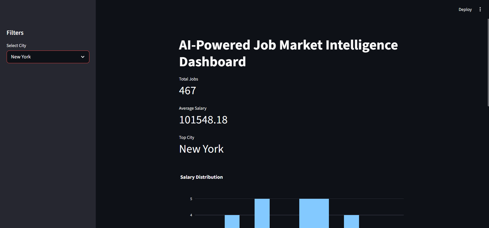
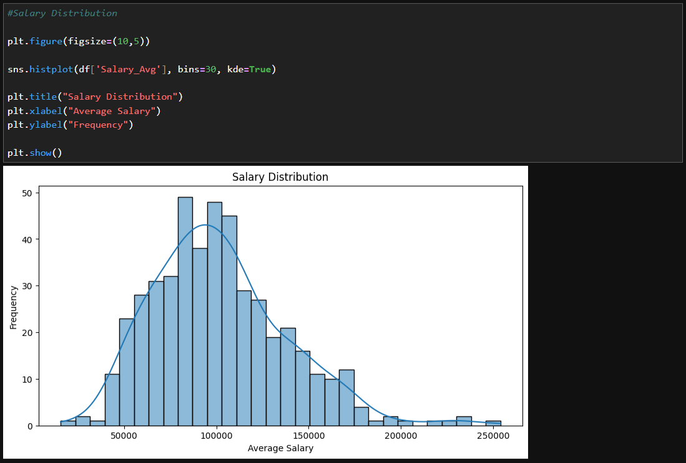
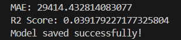

# AI-Powered Job Market Intelligence System

## Project Overview

The AI-Powered Job Market Intelligence System is an end-to-end Data Analytics and Machine Learning project designed to analyze real-world job market trends, salary insights, hiring demand, and in-demand technical skills.

This project uses Python, SQL, Machine Learning, and Streamlit to transform raw job posting data into actionable workforce intelligence.

---

# Features

- Data Cleaning and Preprocessing
- Exploratory Data Analysis (EDA)
- SQL Database Integration using SQLite
- Salary Prediction using Machine Learning
- Skill Demand Analysis
- Hiring Trend Visualization
- Interactive Streamlit Dashboard
- KPI Metrics and Dynamic Filters

---

# Dataset Information

The dataset contains:

- Job Titles
- Salary Information
- Company Details
- Industry Data
- Technical Skills
- Job Locations

Important columns:

- Job_Title_Sim
- Salary_Avg
- Company_Name
- Industry
- Job_City
- Python
- SQL
- AWS
- Spark
- Excel

---

# Tech Stack

| Category | Tools |
|---|---|
| Programming | Python |
| Data Analysis | Pandas, NumPy |
| Visualization | Matplotlib, Seaborn, Plotly |
| Database | SQLite, SQLAlchemy |
| Machine Learning | Scikit-learn |
| Dashboard | Streamlit |

---

# Project Workflow

```text
Dataset
   ↓
Data Cleaning
   ↓
EDA & Visualization
   ↓
SQL Integration
   ↓
Feature Engineering
   ↓
Machine Learning Model
   ↓
Salary Prediction
   ↓
Streamlit Dashboard
````

---

# Exploratory Data Analysis (EDA)

Performed:

* Salary Distribution Analysis
* Top Hiring Cities Analysis
* Industry Demand Analysis
* Skill Demand Analysis
* Correlation Analysis
* Company Rating Analysis

Key Insights:

* Python and SQL are the most demanded skills.
* Data Scientist roles dominate the dataset.
* Cloud technologies like AWS and Spark improve salary potential.
* New York and San Francisco are major hiring hubs.

---

# SQL Integration

Integrated the cleaned dataset into SQLite using SQLAlchemy.

Performed SQL queries for:

* Highest Paying Roles
* Top Hiring Cities
* Most Demanded Skills
* Industry Analysis

Example SQL Query:

```sql
SELECT Job_City,
COUNT(*) AS total_jobs
FROM jobs
GROUP BY Job_City
ORDER BY total_jobs DESC;
```

---

# Machine Learning Model

Used RandomForestRegressor for salary prediction.

Features used:

* Company Rating
* Company Age
* Python
* SQL
* AWS
* Spark
* Excel

Evaluation Metrics:

* Mean Absolute Error (MAE)
* R² Score

---

# Streamlit Dashboard

Built an interactive dashboard using Streamlit and Plotly.

Dashboard Features:

* KPI Metrics
* Salary Distribution Charts
* City-based Filtering
* Top Hiring Companies
* Skill Demand Visualization

Run Dashboard:

```bash
streamlit run dashboard/app.py
```

---

# Installation

Clone Repository:

```bash
https://github.com/kirtisundardey/AI-Powered-Job-Market-Intelligence-System
```

Install Dependencies:

```bash
pip install -r requirements.txt
```

Run SQL Integration:

```bash
python sql_loader.py
```

Train Machine Learning Model:

```bash
python train_model.py
```

Run Streamlit Dashboard:

```bash
streamlit run dashboard/app.py
```

---

# Future Improvements

* Real-time Job Scraping
* NLP-based Skill Extraction
* Recommendation System
* Deep Learning Salary Prediction
* Cloud Deployment

---

# Project Structure

```text
AI-Powered Job Market Intelligence System/
│
├── cleaned_jobs.csv
├── sql_loader.py
├── feature_engineering.py
├── train_model.py
├── salary_model.pkl
├── jobs.db
│
└── dashboard/
    └── app.py
```

---

# Screenshots

## Dashboard



---

## Salary Distribution Chart



---

## ML Results



---

# Author

**👤 Kirti Sundar Dey**  
📊 Data Analyst | Python | SQL | Machine Learning | Streamlit   
🎓 Internship Project by **Rubixe – AI Solutions Company**  
📍 Bengaluru, India  
🔗 [LinkedIn](https://www.linkedin.com/in/kirti-sundar-dey-0954122a5)
